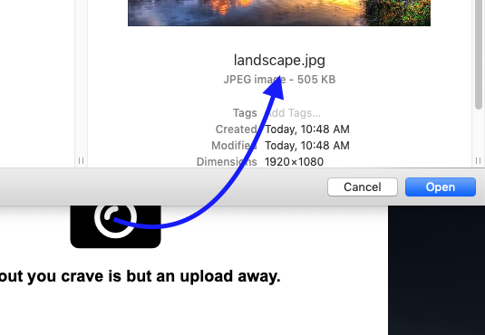
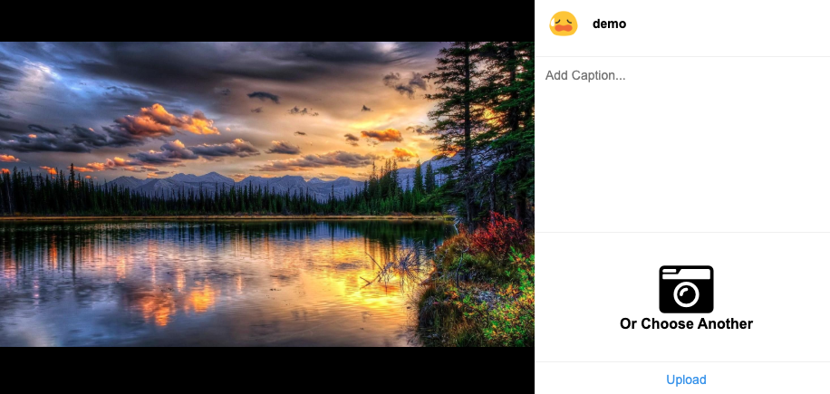
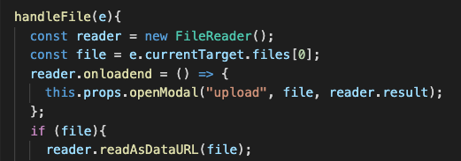
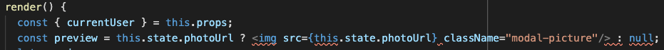

# README

Dopamine Dispenser is a single page clone of Instagram's desktop site. Users can post images with an optional caption, and view them from a profile page.

## Stack / Tech
Dopamine Dispenser makes use of __React__ and__ Redux__ for its front end, and makes use of__ Rails__ for its backend, with __Postgres__ as its database. __AWS__ is used to handle anything image related.

---

## Current Features

### Auth    
  - Full support for user signup, login, logout 
  - Increased or limited access to certain routes and functionality based on user's logged in status and current user checks

### Images  
  - Users can access all their posted images from a profile page
  - Users can seamlessly go from one image show modal to the next via arrows
  - Image creation, updates, or deletion will be rendered immediately without need for a full page refresh

---

## Challenges and Solutions

### Image Upload
Because Instagram's desktop site has limited functionality (cannot post, update, or delete) for images, figuring out an elegant solution for image uploads that remained in-style with the Instagram theme was a challenge.

As Instagram's site seemed very fond of modals, I chose to create a preupload modal, which served as the source for uploading an image. Upon image upload, a new modal with a preview of the image is rendered.

Here, an preview of the uploaded image is rendered, and the options to add a caption, choose another image, or upload are presented. Passing the file from modal to modal was done by adding the file into the modal slice of state, so that the upload image modal could have access via props.

---

## Coming Soon

### Follows
  - Users will be able to follow other users, creating an index of images from followed users

### Likes
  - Users will be able to like posts, which will be tracked on the image show modal

### Commenting
  - Users will be able to comment on posts, which will be tracked on the image show modal
        
